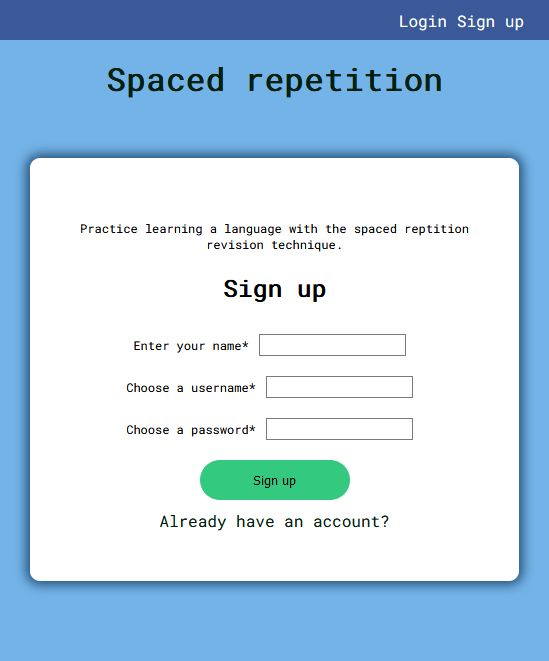
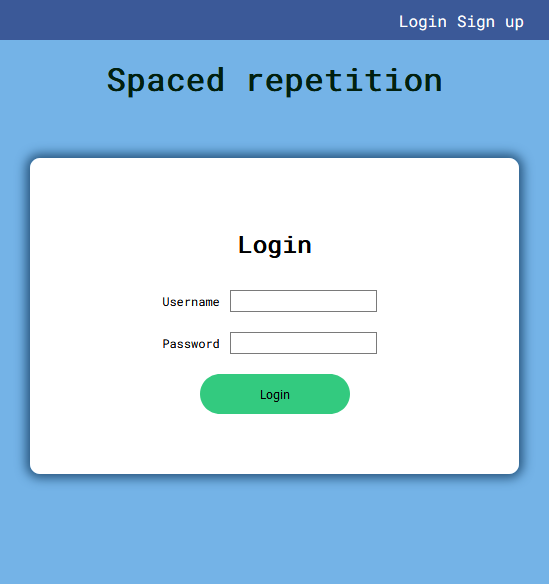
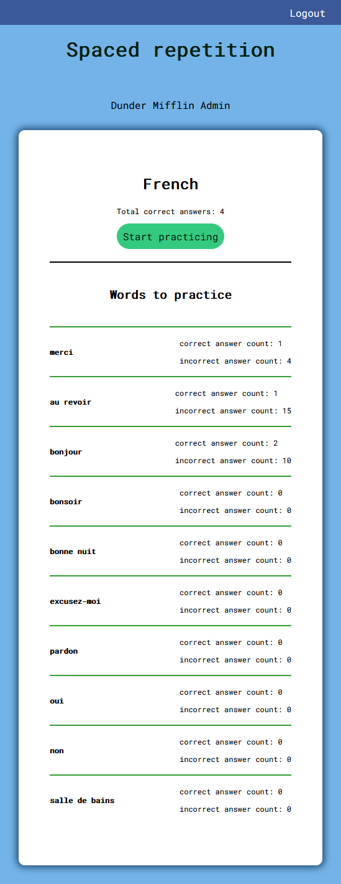
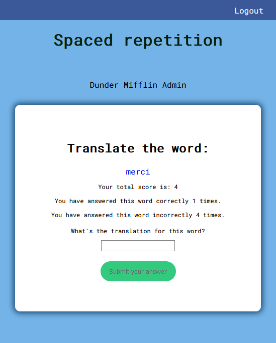
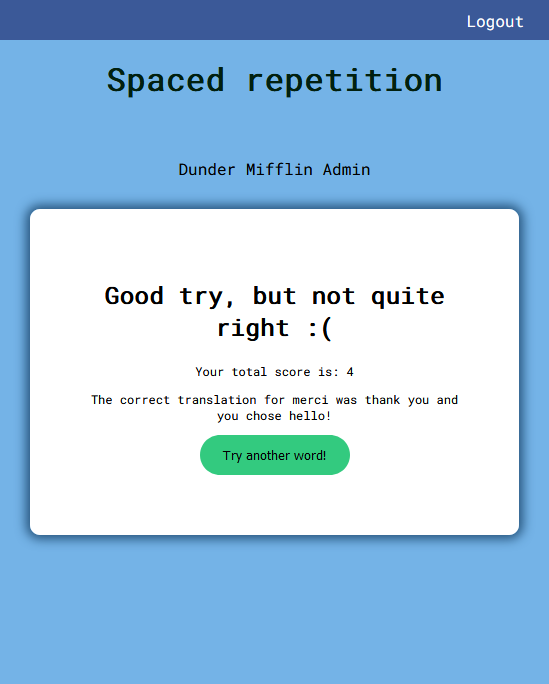

## Application
french-langue

## Links
live site: https://spaced-rep-french.vercel.app 
backend: https://damp-bastion-87075.herokuapp.com/

## Using The API
Currently the API supports GET and POST endpoints.

- Unprotected Endpoints 
+ SignUp: POST (https://url/api/api/user) 

- Protected Endpoints 
    + Login: POST (https://url/api/auth/token) 
    + Get Words: GET (https://url/api/auth/language) 
    + Get Head: GET (https://url/api/auth/language/head) 
    + POST Guess: POST (https://url/api/auth/language/guess) 

## Screen Shots
 
 
 
 
 

### Summary
This app helps users implement the spaced repetition technique to help users learn ten preloaded French words.
New Users can create an account. Returning users can log in and begin practicing with instant feedback and
reinforcement.

## Technologies
  - React
  - Node.js
  - JavaScript
  - Postgresql 
  - Mocha, Chai
  - Express
  - Jest
